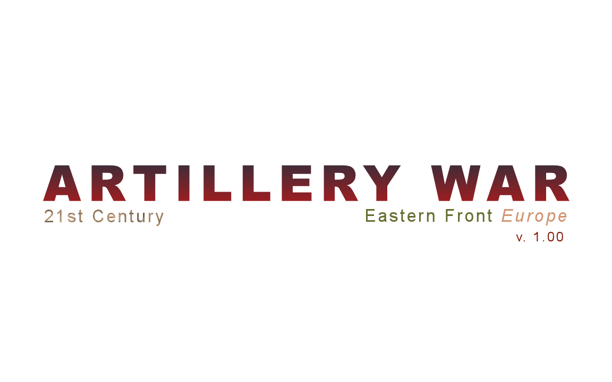
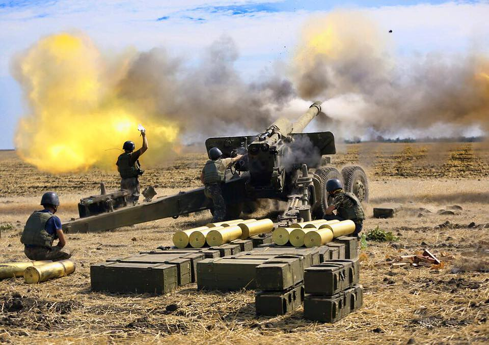

#  ARTILLERY WAR, 21ST CENTURY, EASTERN FRONT, EUROPE - python game  
Artillery War is an engaging strategic simulation set in the unstable environment of 21st century Europe, casting
you into the heart of fierce artillery battles on the Eastern Front.
<br>
  

## Project Components
- Application Modules: 
  - `settings.py` - Game configurations and settings.
  - `game_loop.py` - The heartbeat, the main loop of the game.
  - `main.py` - The main loop of the app (tkinter), launch file.
  - `setup.py` - Game initialization and setup routines.
  - `map.py` - Visual representation of the battlefield.
  - `radar.py` - Real-time tracking and targeting system.
  - `units.py` - Definition of game units.
  - `console.py` - A command interface for the player.
  - `calculations.py` - Distance and damage computations.
- Additional Documents: `about.txt` & `rules.txt` for comprehensive game info.
## Requirements

- **Python Version**: 3.11  
- **Customtkinter**: 5.2.2
- **Pillow**: 9.5.0  
- **Pygame**: 2.6.0  
Note. If display screen is scalled (e.g. to 125%), the game may not run in full screen mode or may contain
distortions, the game was designed for screen scale 100% and resolution not less than 1920x1080.
## Installation Instructions

Follow these steps to set up the application locally:

1. **Ensure you have Python 3.11 installed** on your system. You can download Python 3.11 from [Python's official
website](https://www.python.org/downloads/).
2. **Download the project** from its [GitHub repository](https://github.com/Tomas4python/artillery_war.git) and extract
it into a new folder or use GIT to clone the project:
   - Open **Command Prompt** or **PowerShell**.
   - Navigate to the project folder:
     ```
     cd path\to\project\folder
     ```
   - Clone the project:
     ```
     git clone "https://github.com/Tomas4python/artillery_war.git"
     ```

3. **Set Up a Virtual Environment**:
   - Navigate to the 'artillery_war' folder:
     ```
     cd path\to\project\folder\artillery_war
     ```
   - Create a new virtual environment named `venv`:
     ```
     python -m venv venv
     ```
   - Activate the virtual environment:
     ```
     .\venv\Scripts\activate
     ```

4. **Install Dependencies**:
   - In activated virtual environment (venv) navigate to 'artillery_war' folder:
     ```
     cd path\to\project\folder\artillery_war
     ```
   - Install all required dependencies:
     ```
     pip install -r requirements.txt
     ```

By following these steps, you'll have a clean and isolated Python environment for running and testing Artillery War App.

## Launching the Application

Navigate to the project folder and activate the virtual environment. Run the application by executing:
```
python main.py
```  
<br>

  

---
