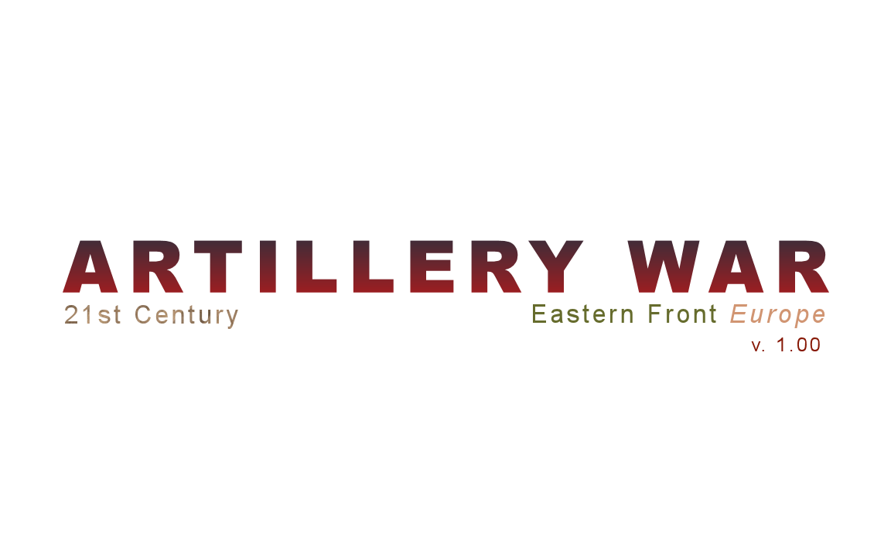
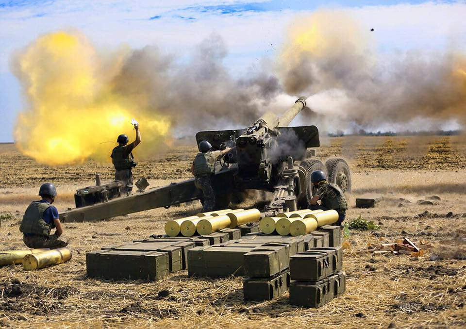

#  ARTILLERY WAR, 21ST CENTURY, EASTERN FRONT, EUROPE - python game  
Artillery War is an engaging strategic simulation set in the unstable environment of 21st century Europe, casting
you into the heart of fierce artillery battles on the Eastern Front.
<br>
  

## Requirements
- Best on **Windows 11**; also runs on **Linux** (X11 desktop, see [Linux](#linux))
- **Python**: 3.11
- **Libraries** (installed by `requirements.txt`): customtkinter 5.2.2, Pillow 9.5.0, pygame 2.6.0

Note: the game was designed for screen scale 100% and a resolution of at least 1920x1080. If the display is scaled
(e.g. to 125%), the game may not run in full screen or may show distortions.

## Installation

1. **Install Python 3.11** from [Python's official website](https://www.python.org/downloads/).
2. **Get the project**: download it from the [GitHub repository](https://github.com/Tomas4python/artillery_war) and
   extract it, or clone it with Git. Open **PowerShell** in the folder where you want the project and run:
   ```
   git clone https://github.com/Tomas4python/artillery_war.git
   cd artillery_war
   ```
3. **Create and activate a virtual environment** (an isolated Python for this project):
   ```
   python -m venv venv
   .\venv\Scripts\activate
   ```
4. **Install the dependencies**:
   ```
   pip install -r requirements.txt
   ```
   For development (tests, linters and the executable builder) install `requirements-dev.txt` instead; it includes
   everything from `requirements.txt`.

## Launching the Game

In the project folder, with the virtual environment activated (`.\venv\Scripts\activate`), run:
```
python main.py
```
`python -m artillery_war` does the same. The game opens in full screen; press **Space** on the welcome screen.
<br>

  

### Keys during a battle
| Key | Action                                                      |
|-----|-------------------------------------------------------------|
| `c` | field console (fire your guns here)                         |
| `r` | radar                                                       |
| `d` | drone view (Defender only)                                  |
| `s` | statistics, shown over the current radar or drone view      |
| `w` | withdraw from the battle (answer `y` or `n` on the console) |
| `e` | on the battle report: end the battle                        |
| `q` | quit the game                                               |

The console and the statistics are one tablet: drag it by its dark frame to move it where it covers least of the map. Each new battle starts with the tablet in the middle again.

The full rules are in the game menu under **Rules**.

## Creating the Executable (`dist`)

The game can be packaged with [PyInstaller](https://pyinstaller.org) into a folder that runs without Python
installed. With the virtual environment activated and `requirements-dev.txt` installed:
```
pyinstaller --noconfirm artwar.spec
```
After about 30 seconds the game is in **`dist\artwar\`**: run `dist\artwar\artwar.exe`. To share the game, zip the
whole `dist\artwar` folder (not just the `.exe`: it needs the `_internal` folder next to it).

- Run the same command again after every change to the code or to the files in `artillery_war/assets/`; it replaces
  the old `dist\artwar`. Close the game first, because Windows locks a running `.exe`.
- PyInstaller also creates a **`build\`** folder with its intermediate files. It only speeds up the next build and
  can be deleted at any time.
- `build\` and `dist\` are not stored in Git (see `.gitignore`); they are recreated from the code by the command above.
- On Linux the same command creates `dist/artwar/artwar`; an executable only runs on the system it was built on.

## Linux

The game runs on Linux with an X11 desktop (or XWayland). Tkinter is not part of every Linux Python, so install it
from the distribution first, e.g. on Debian/Ubuntu:
```
sudo apt install python3.11 python3.11-venv python3-tk
```
Then follow the steps above, using `python3.11 -m venv venv` and `source venv/bin/activate`.

Differences from Windows:
- The console tablet has square corners (rounded window corners need a Windows feature).
- If the Courier New / Arial fonts are missing, similar installed fonts are used (Liberation or DejaVu);
  `sudo apt install fonts-liberation` gives the closest look.
- Without an audio device the game runs silently.

## Development

With `requirements-dev.txt` installed:
```
pytest                                        # tests
ruff check . ; ruff format --check . ; mypy   # linter, formatting, type checks
```
The tests in `tests/` are **characterization tests**: they replay recorded battles and whole wars and check that the
game maths (ballistics, damage, units, resources) gives exactly the recorded results, so the hand-tuned game balance
cannot change by accident. The same checks run on GitHub for Windows and Ubuntu on every push.

## Project Components
- `main.py` - launch file.
- `artillery_war/core/` - game logic without any user interface: battles, ballistics, units and the war campaign.
- `artillery_war/ui/` - the windows: main menu, field console, drone map, radar and reports.
- `artillery_war/config.py` - game balance constants and player options.
- `artillery_war/platform_utils.py` - the differences between Windows and Linux.
- `artillery_war/assets/` - images, sounds, `rules.txt`, `about.txt` and `changelog.txt`.
- `tests/` - characterization tests that keep the game balance unchanged.
- `artwar.spec` - PyInstaller build settings.

## Credits
Game design, rules and balance by Tomas Suslavicius (version 1.01, 2023).
Version 1.02 was refactored with **Claude Opus 5.5** (Anthropic): the code was restructured and tested, bugs were
fixed, Linux support, performance improvements and the tablet design were added, keeping the original game mathematics. The only balance
change, at the author's request, reduces the war-long damage capacity by a third.
See `artillery_war/assets/changelog.txt` for the full list of changes.

---
